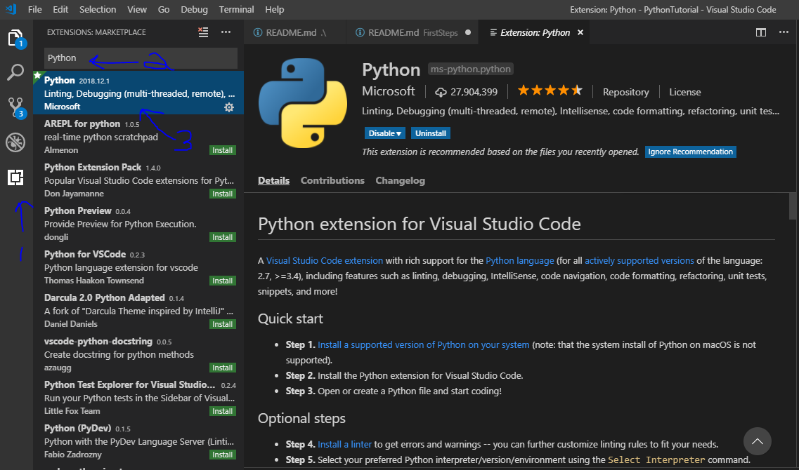

# Preparation

To do these tutorials, you'll need to install Python on your system (we will be using Python 3). You'll also need a text editor. 

## Install Python 3

We'll be using Python 3 for the rest of the examples. Python 2 is still very prevalent, so I'll try to point out where there are changes in the language as we come across them.

### Windows

The best package for setting up Python on a Windows computer is [Anaconda](https://www.anaconda.com/download/). Grab the 3.x version (3.7 as of this writing) This should be straightforward to install. 

### Linux 

While there is an Anaconda installation for Linux, the version provided by your package manager should be sufficient. 

For Debian/Ubuntu derived system, type the following in the terminal:

```
sudo apt-get install python3 python3-pip
```

### Test the install

In Windows, open up an Anaconda prompt, or in Linux, open up the terminal and type:

For Windows
```
python --version
```
or for Linux
```bash
python3 --version
```

This should return with something like:

```
Python 3.7.1
```

You may have a different number, but be sure that the first one is a 3.

## Get a (good) text editor

For writing code, syntax highlighting is really handy. There are plenty of different pieces of software that will do this. Good options are [Notepad++](https://notepad-plus-plus.org/download/v7.6.2.html), [Atom](https://atom.io/), [Sublime](https://www.sublimetext.com/) or [VSCode](https://code.visualstudio.com/). There are many, many other good options, including Python specific IDE's like [PyCharm](https://www.jetbrains.com/pycharm/), and the classics, like vi(m) or emacs. 

I recommend [VSCode](https://code.visualstudio.com/), and is what I use for presenting and preparing this talk.

If you are using VSCode, you need to install the Python extension to get code highlighting. 



The final step with VSCode is to change the interpreter. It should by default find the default system interpreter, but if you ever need to change it (for instance, to a different virtual environment, see the next section) type Ctrl+Shift+P and either scroll to select select, or start typing until "Python: Select Interpreter" is highlighted. From here you can select from different interpreters. If you have more than one, select the one that says version 3.x (matching whatever version you installed.)

Next: [Virtual Environments](VirtualEnvironments.md)